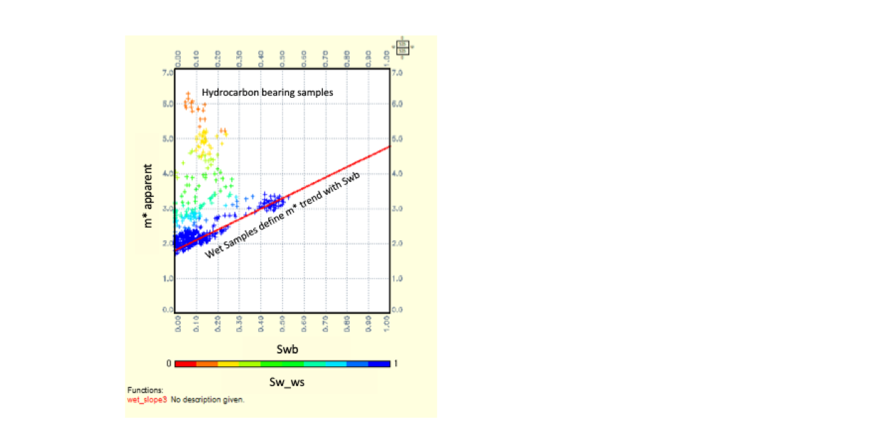
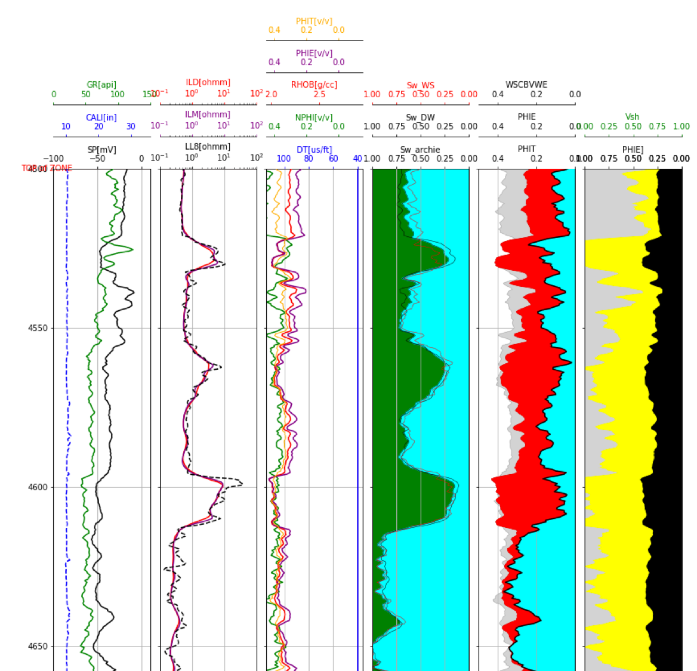

# Basic-Well-Log-Interpretation-from-PetroGG-adapted-to-Gulf-Coast-Example

This repository started with PetroGG written by Mihai in GitHub that has been modified to be used with our Gulf of Mexico shaly-sand example data. The Gulf of Mexico data is in the GulfCoast.txt text file provided. PetroGG provides for an excellent foundation for our work. We appreciate all the fine work of Mihai on PetroGG and the suitability of his code to be expanded upon for this application of PetroGG. 

We have made a few changes to PetroGG. First of all, we have modified the code to use Vshale and not Vclay as was previously employed. Almost all shales have less than 100% clay volume. We have personally sampled some of the greasiest, gumbo shales to find that the maximum clay content was only about 65% according to the XRD or FTIR mineralogy results. Therefore, estimating the endpoint parameters for clay points is a challenge since these 100% clay points are imaginary points and do not exist in the data. Instead we use shale point parameters which can be determined from most shaly-sands data sets. However, with sufficient mineralogy data from core samples or elemental log data like Schlumberger's Elemental Capture Spectroscopy (ECS) we can model the volume of clay for future applications. 

We have included two additional Saturation models suitable for shaly-sand analysis. Mihai has another excellent repository with various Petrophysical routines including saturation models. We started with his Waxman-Smits and Dual-Water saturation models from this repository and then made a few modifications for our saturation code found in this project. 

For Dual-Water we are using the George Coates (1) MRIAN method that was primarily used at Numar. MRIAN simultaneously uses both conventional logs and NMR log data for the interpretation. The NMR data has been found to be quite useful in assessing reservoir quality and defining the volume of non-movable Capillary Bound Water (MBVI). MBVI is quite different to the volume of Clay Bound Water (CBW) or CBW saturations (Swb) associated with the waters chemically bound to the shales. CBW is determined from the difference between Total (PHIT) and Effective (PHIE) porosity. 

MBVI is calculated from the NMR T2 distribution by partitioning this T2 distribution into MBVI and Free Fluid (FFI). FFI pore volume has larger pores with movable fluid where MBVI has smaller pores with non-movable fluids. We typically compare our log analysis based Bulk Volume Water in the effective porosity system (BVWe) to MBVI, in the effective porosity system, to determine what intervals have hydrocarbon saturations at irreducible water saturation with no movable water. When BVWe is higher than MBVI, then we expect some movable water depending on the relative permeability of these fluids. The next repository will cover this application in detail. 

For our Waxman-Smits saturation model we use the Hill, Shirley and Klein technique(2) to solve for Qv from Swb as shown below:

    Qv = Swb/(0.6425/((Fluid_Density*Salinity(kppm))**0.5) + 0.22) 

We then use the Waxman-Smits saturation equation provided by Crain in lieu of an iterative approach. 

We have found that Waxman-Smits method is a bit more flexible to use in shaly-sand interpretations in that we can model the Waxman-Smits cementation exponent m* to vary with Swb according to the trends observed in the wet intervals from our Swb vs. apparent m* cross plot as shown below.  Apparent m* increases as Swb increases in the wet intervals which leads to less apparent hydrocarbon saturations being calculated with higher Swb.  This is not true if one uses a constant m* for the analysis. The m* at Swb=0 y-intercept is the Archie m, but in this case m* increases with increased Swb. We have also found that a wrong Rw can lead to an unrealistic y-intercept to give us feedback on our choise of Rw too.

In the plot above we calculated the apparent m* data in another program to make this plot using the following equation:

    m* apparent = log10(Rw /(Rt*(1 + Rw*B*Qv))) / log10(PHIT)  

This will be included in a future update.

Depth Plot:

1. Coates, G.R., Gardner, J.S., and Miller, D.L., 1994, "Applying pulse-echo NMR to shaly sand formation evaluation", paper B, 35th Annual SPWLA Logging Symposium Transactions, 22 p.

2. Hill, H.J., Shirley, O.J., Klein, G.E.: “Bound Water in Shaley Sands - Its Relation to Qv and Other Formation Properties”, Log Analyst, May-June 1979.

3. Dacy, J., Martin, P.: "Practical Advances in Core-Based Water Saturation Analysis of Shaly Tight Gas Sands", SCA, SCA2009-29, 2009.

